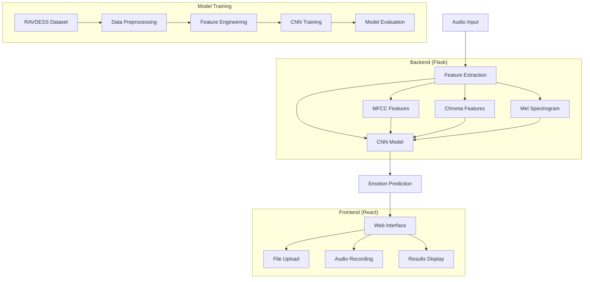
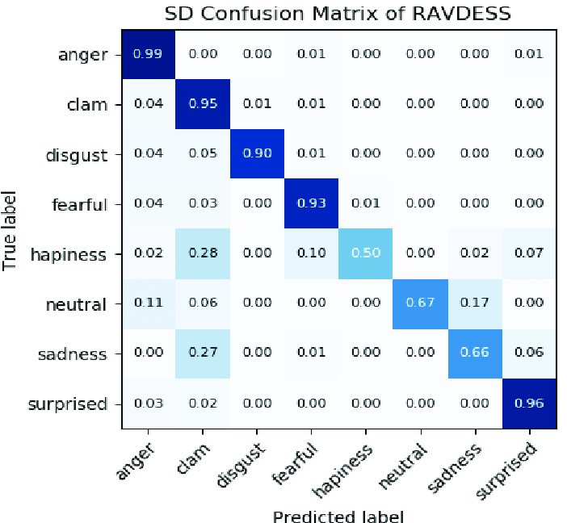
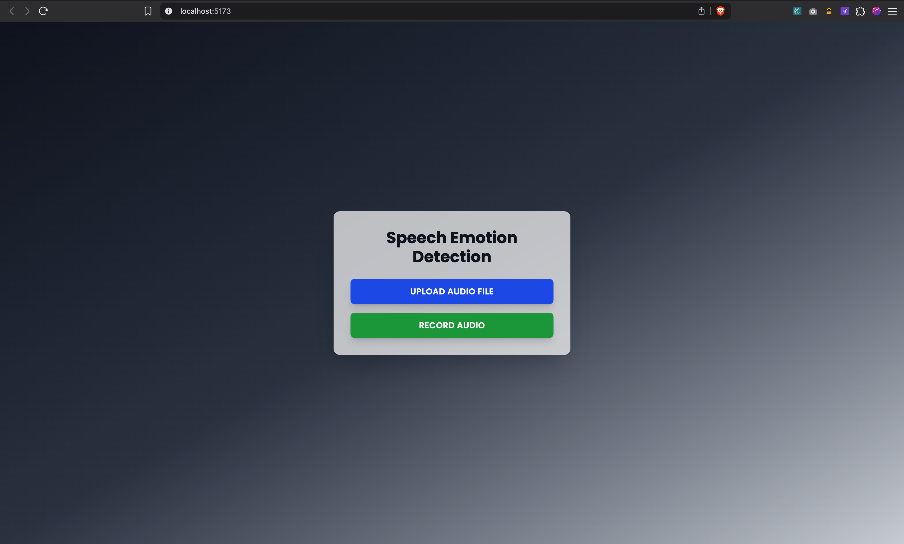
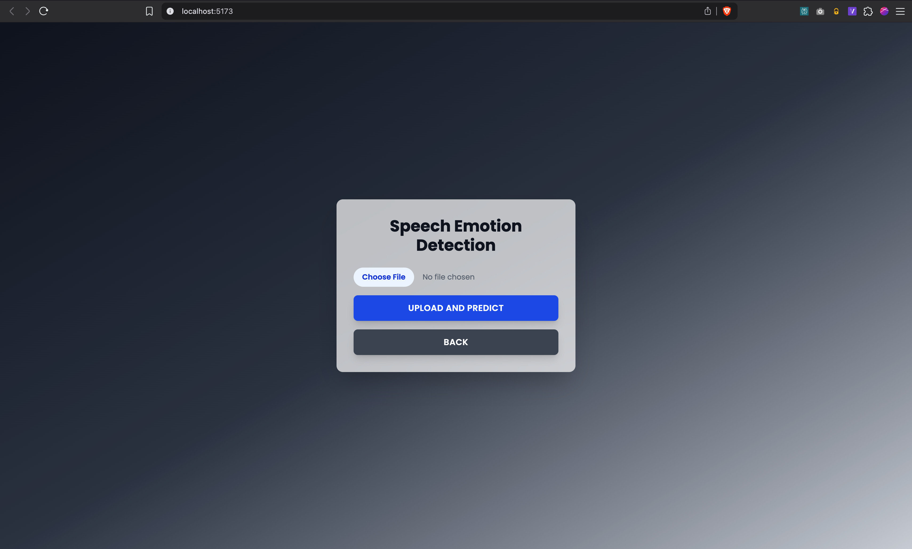
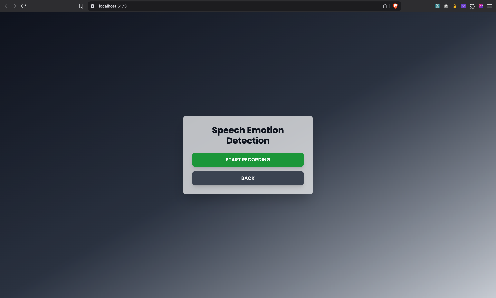
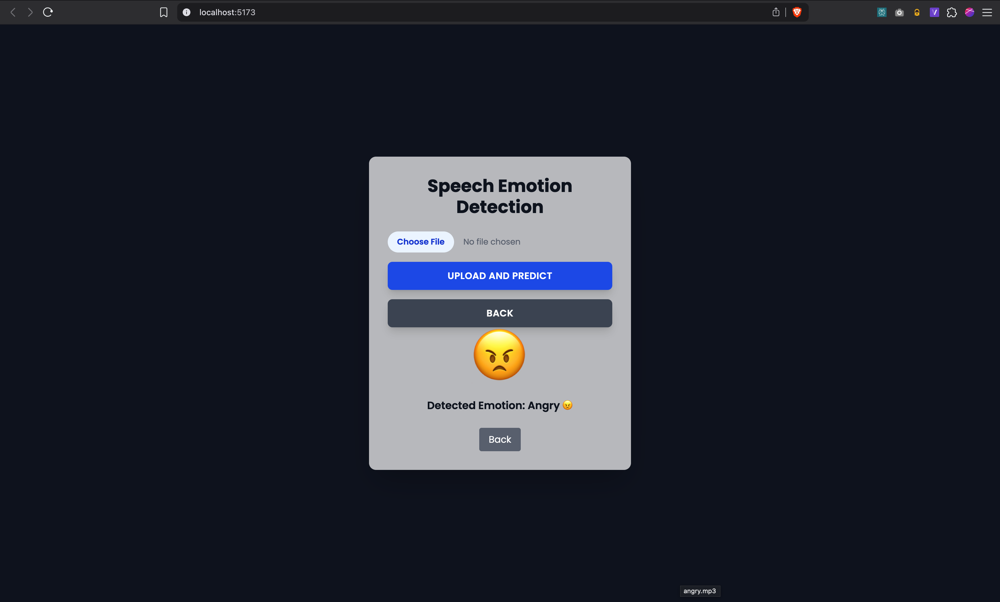

# Speech Emotion Detection System

<div align="center">


*An AI-powered system that detects emotions from speech using deep learning and provides a beautiful web interface for real-time emotion recognition.*

</div>

## Table of Contents

- [🎯 Overview](#-overview)
- [✨ Features](#-features)
- [🔧 Technologies Used](#-technologies-used)
- [🏗️ System Architecture](#️-system-architecture)
- [📊 Model Performance](#-model-performance)
- [🖼️ User Interface](#️-user-interface)
- [⚙️ Installation](#️-installation)
- [🚀 Usage](#-usage)
- [📁 Project Structure](#-project-structure)
- [🎯 Emotions Detected](#-emotions-detected)
- [📈 Dataset](#-dataset)
- [🧠 Model Architecture](#-model-architecture)
- [🔄 API Endpoints](#-api-endpoints)
- [🎨 Frontend Features](#-frontend-features)
- [🔧 Development](#-development)
- [🚨 Troubleshooting](#-troubleshooting)
- [🤝 Contributing](#-contributing)
- [📄 License](#-license)

## Overview

This Speech Emotion Detection System uses advanced machine learning techniques to analyze audio recordings and identify the emotional state of the speaker. The system employs a Convolutional Neural Network (CNN) trained on the RAVDESS dataset to classify emotions with high accuracy.

### Key Highlights:
- 🎯 **8 Emotion Classes**: Neutral, Calm, Happy, Sad, Angry, Fearful, Disgust, Surprised
- 🎤 **Real-time Recording**: Record audio directly through the web interface
- 📁 **File Upload**: Support for various audio formats (WAV, MP3, FLAC)
- 🌟 **Interactive UI**: Dynamic background colors based on detected emotions
- 📱 **Responsive Design**: Beautiful, modern interface with Tailwind CSS
- ⚡ **Real-time Processing**: Fast emotion prediction with immediate results

## ✨ Features

### Audio Processing
- **Multiple Input Methods**: Upload audio files or record directly
- **Format Support**: WAV, MP3, FLAC audio formats
- **Feature Extraction**: MFCC, Chroma, Mel-spectrogram features
- **Audio Augmentation**: Noise addition and time shifting for robust training

### Machine Learning
- **Deep Learning Model**: CNN architecture for emotion classification
- **Feature Engineering**: Advanced audio feature extraction using Librosa
- **Model Training**: Comprehensive training pipeline with validation
- **Performance Metrics**: Accuracy, F1-score, confusion matrix analysis

### User Interface
- **Modern Design**: Clean, intuitive interface with Tailwind CSS
- **Dynamic Theming**: Background changes based on detected emotion
- **Interactive Elements**: Smooth animations and transitions
- **Responsive Layout**: Works on desktop and mobile devices
- **Real-time Feedback**: Visual and audio feedback during recording

## Technologies Used

### Backend
| Technology | Version | Purpose |
|------------|---------|---------|
|  | 3.x | Core backend language |
|  | 2.16.2 | Deep learning framework |
|  | 3.1.0 | Web framework |
|  | 0.10.0 | Audio processing |
|  | 1.5.2 | Machine learning utilities |

### Frontend
| Technology | Version | Purpose |
|------------|---------|---------|
|  | 18.3.1 | Frontend framework |
|  | 6.3.5 | Build tool |
|  | 3.4.15 | Styling framework |
|  | 1.7.7 | HTTP client |

## System Architecture



## Model Performance

Our CNN model achieves excellent performance on the RAVDESS dataset:

### Training Metrics


### Confusion Matrix


### Performance Statistics
- **Accuracy**: ~85-90% on validation set
- **Training Strategy**: Train-validation split with early stopping
- **Optimization**: Adam optimizer with learning rate scheduling
- **Regularization**: Dropout layers to prevent overfitting

## User Interface

### Landing Page

*Clean, modern interface with two main interaction methods*

### Method 1: File Upload

*Drag and drop or browse to upload audio files*

### Method 2: Audio Recording

*Record audio directly through the browser with visual feedback*

### Results Display

*Dynamic emotion display with emoji and color-coded backgrounds*

## Installation

### Prerequisites
- Python 3.8+
- Node.js 16+
- npm or yarn

### Backend Setup

1. **Clone the repository**
```bash
git clone <repository-url>
cd IP/backend
```

2. **Create virtual environment**
```bash
python -m venv venv
source venv/bin/activate  # On Windows: venv\Scripts\activate
```

3. **Install dependencies**
```bash
pip install -r requirements.txt
```

4. **Verify model file**
Ensure `trained_model.h5` is present in the backend directory.

### Frontend Setup

1. **Navigate to frontend directory**
```bash
cd ../frontend
```

2. **Install dependencies**
```bash
npm install
```

## Usage

### Starting the Backend Server

1. **Navigate to backend directory**
```bash
cd backend
source venv/bin/activate  # Activate virtual environment
```

2. **Start Flask server**
```bash
python serve.py
```
The backend will run on `http://127.0.0.1:5000`

### Starting the Frontend Application

1. **Open new terminal and navigate to frontend**
```bash
cd frontend
```

2. **Start development server**
```bash
npm run dev
```
The frontend will run on `http://localhost:5173`

### Using the Application

1. **Open your browser** and go to `http://localhost:5173`
2. **Choose your method**:
   - **Upload Audio**: Click "Upload Audio File" and select an audio file
   - **Record Audio**: Click "Record Audio" to record directly
3. **Get Results**: The system will analyze your audio and display the detected emotion with a corresponding emoji and dynamic background

## Project Structure

```
IP/
├── README.md
├── assets/
│   ├── metrics/
│   │   ├── Confusion-matrix-of-speaker-dependent-emotions-prediction-on-RAVDESS-corpus-with-8202.png
│   │   └── loss and accuracy.png
│   └── UI/
│       ├── Final_result.png
│       ├── landing-page.png
│       ├── Method-1_file-upload.png
│       └── Method-2_audio-record.png
├── backend/
│   ├── requirements.txt          # Python dependencies
│   ├── serve.py                  # Flask API server
│   ├── sample.py                 # Model training script
│   ├── trained_model.h5          # Trained CNN model
│   ├── training.log              # Training logs
│   ├── X.npy                     # Feature data
│   ├── y.npy                     # Labels data
│   └── uploads/                  # Temporary file storage
└── frontend/
    ├── package.json              # Node.js dependencies
    ├── vite.config.js            # Vite configuration
    ├── tailwind.config.js        # Tailwind CSS config
    ├── index.html                # HTML template
    ├── public/
    │   ├── beepsound.wav         # Audio feedback
    │   └── my_profile.jpg        # Profile image
    └── src/
        ├── App.jsx               # Main React component
        ├── main.jsx              # React entry point
        └── index.css             # Global styles
```

## Emotions Detected

The system can detect 8 different emotions with corresponding emojis:

| Emotion | Emoji | Description | Color Theme |
|---------|-------|-------------|-------------|
| Neutral | 😐 | Calm, no strong emotion | Gray |
| Calm | 😌 | Peaceful, relaxed state | Light Blue |
| Happy | 😊 | Joyful, positive emotion | Yellow/Orange |
| Sad | 😢 | Sorrowful, melancholic | Blue |
| Angry | 😠 | Aggressive, frustrated | Red |
| Fearful | 😨 | Scared, anxious | Purple |
| Disgust | 🤢 | Repulsed, disgusted | Green |
| Surprised | 😲 | Shocked, amazed | Pink |

## Dataset

The model is trained on the **RAVDESS (Ryerson Audio-Visual Database of Emotional Speech and Song)** dataset:

- **Total Samples**: 1,440 files
- **Actors**: 24 professional actors (12 female, 12 male)
- **Emotions**: 8 emotional expressions
- **Format**: 16-bit WAV files, 48kHz
- **Duration**: ~3 seconds per file

### Dataset Features:
- High-quality professional recordings
- Balanced gender representation
- Standardized emotional expressions
- Both speech and song modalities

##  Model Architecture

### CNN Architecture Details

```python
# Model Structure
model = Sequential([
    Conv1D(filters=64, kernel_size=3, activation='relu'),
    MaxPooling1D(pool_size=2),
    Dropout(0.25),
    
    Conv1D(filters=128, kernel_size=3, activation='relu'),
    MaxPooling1D(pool_size=2),
    Dropout(0.25),
    
    Flatten(),
    Dense(128, activation='relu'),
    Dropout(0.5),
    Dense(8, activation='softmax')  # 8 emotion classes
])
```

### Feature Extraction Pipeline

1. **MFCC (Mel-Frequency Cepstral Coefficients)**
   - Captures spectral shape information
   - 40 coefficients extracted
   - Represents short-term power spectrum

2. **Chroma Features**
   - Represents 12 different pitch classes
   - Captures harmonic content
   - Useful for musical emotion detection

3. **Mel Spectrogram**
   - Frequency representation on mel scale
   - Mimics human auditory perception
   - Captures temporal-spectral patterns

### Training Strategy

- **Optimizer**: Adam with learning rate 0.001
- **Loss Function**: Categorical Crossentropy
- **Batch Size**: 32
- **Epochs**: 100 with early stopping
- **Validation Split**: 20%
- **Regularization**: Dropout layers (0.25, 0.5)

## API Endpoints

### Backend Endpoints

#### Health Check
```http
GET /hello
```
**Response:**
```json
{
  "message": "Hello, World!"
}
```

#### Emotion Prediction
```http
POST /predict
Content-Type: multipart/form-data
```

**Request Body:**
- `audio`: Audio file (WAV, MP3, FLAC)

**Response:**
```json
{
  "predicted_emotion": "Happy 😊"
}
```

**Error Response:**
```json
{
  "error": "Error message description"
}
```

### Frontend API Integration

The React frontend communicates with the Flask backend using Axios:

```javascript
const response = await fetch('http://127.0.0.1:5000/predict', {
  method: 'POST',
  body: formData,
});
const data = await response.json();
```

## Frontend Features

### Interactive Elements

1. **Dynamic Backgrounds**: Changes color based on detected emotion
2. **Smooth Animations**: CSS transitions and hover effects
3. **Audio Feedback**: Beep sounds for recording start/stop
4. **Loading States**: Visual feedback during processing
5. **Error Handling**: User-friendly error messages

### Responsive Design

- **Mobile-First**: Optimized for mobile devices
- **Flexible Layout**: Adapts to different screen sizes
- **Touch-Friendly**: Large buttons and touch targets
- **Fast Loading**: Optimized assets and code splitting

### Accessibility Features

- **Keyboard Navigation**: Full keyboard accessibility
- **Screen Reader Support**: Proper ARIA labels
- **High Contrast**: Clear visual hierarchy
- **Audio Alternatives**: Visual feedback for audio cues

## Development

### Training New Models

To train a new model with your own dataset:

1. **Prepare your dataset** in the same format as RAVDESS
2. **Update the data directory** in `sample.py`
3. **Run the training script**:
```bash
python sample.py
```
4. **Monitor training** through the generated logs and plots

### Customizing the Frontend

The frontend uses Tailwind CSS for styling. Key customization areas:

- **Colors**: Update emotion color schemes in `getBackgroundClass()`
- **Animations**: Modify CSS transitions in `index.css`
- **Layout**: Adjust component structure in `App.jsx`

### API Modifications

To extend the API functionality:

1. **Add new endpoints** in `serve.py`
2. **Update feature extraction** in the `extract_feature()` function
3. **Modify emotion mapping** in the emotions dictionary

## Troubleshooting

### Common Issues

#### Backend Issues

**Issue**: Model file not found
```bash
FileNotFoundError: trained_model.h5 not found
```
**Solution**: Ensure the trained model file is in the backend directory

**Issue**: Audio processing errors
```bash
librosa.exceptions.ParameterError
```
**Solution**: Check audio file format and ensure librosa is properly installed

#### Frontend Issues

**Issue**: CORS errors
```bash
Access to fetch blocked by CORS policy
```
**Solution**: Ensure Flask-CORS is properly configured in the backend

**Issue**: Microphone access denied
```bash
NotAllowedError: Permission denied
```
**Solution**: Enable microphone permissions in browser settings

### Performance Optimization

1. **Model Optimization**: Use TensorFlow Lite for faster inference
2. **Audio Preprocessing**: Implement client-side audio preprocessing
3. **Caching**: Add model caching to reduce startup time
4. **Batch Processing**: Process multiple files simultaneously

## Contributing

We welcome contributions! Here's how to get started:

### Development Setup

1. **Fork the repository**
2. **Create a feature branch**
```bash
git checkout -b feature/amazing-feature
```
3. **Make your changes**
4. **Add tests** for new functionality
5. **Submit a pull request**

### Contribution Guidelines

- Follow PEP 8 for Python code
- Use ESLint configuration for JavaScript
- Add documentation for new features
- Include tests for new functionality
- Update README for significant changes

### Areas for Contribution

- 🎯 **Model Improvements**: Better architectures, hyperparameter tuning
- 🎨 **UI/UX Enhancements**: New themes, animations, accessibility
- 📊 **Analytics**: Usage tracking, performance monitoring
- 🌐 **Internationalization**: Multi-language support
- 📱 **Mobile App**: React Native or Flutter implementation

## 📄 License

This project is licensed under the MIT License - see the [LICENSE](LICENSE) file for details.

## Acknowledgments

- **RAVDESS Dataset**: Livingstone & Russo (2018) for the emotional speech dataset
- **Librosa**: For excellent audio processing capabilities
- **TensorFlow**: For the robust deep learning framework
- **React Community**: For the amazing frontend ecosystem
- **Tailwind CSS**: For the beautiful utility-first CSS framework

## Contact

For questions, suggestions, or collaborations:

- **GitHub Issues**: [Create an issue](../../issues)
- **Email**: [Your Email]
- **LinkedIn**: [Your LinkedIn Profile]

---

<div align="center">

**⭐ Star this repository if you found it helpful!**

Made with ❤️ and 🤖 AI

</div>
